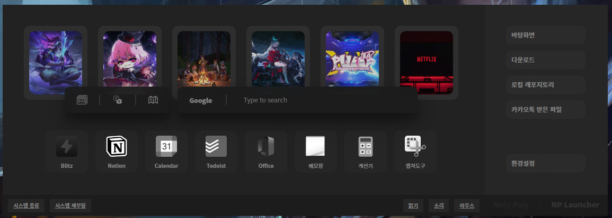

# NP-Launcher: 북마크 런처 프로그램

NP-Launcher는 컴퓨터 사용 경험을 향상시키는 북마크 런처 프로그램입니다. 프로그램 실행, 웹사이트 접근, 폴더 탐색, 구글 검색, 윈도우 기능 실행 등의 작업을 단 몇 초 내에 할 수 있게 해 줍니다.

[📚 프로젝트 회고록](https://jisulog.com/docs/essay/project-review/2023-np-launcher)

## 🚀 시작하기

### 설치 방법

다운로드 받은 프로그램을 시작 프로그램 폴더에 복사하여 사용합니다.

## ✨ 주요 기능

- **로컬 프로그램 실행**: 로컬에 설치된 프로그램을 빠르게 실행합니다.
- **웹사이트 접속**: 도메인을 북마크에 추가하여 원클릭으로 웹사이트에 접속합니다.
- **폴더 탐색기 실행**: 원하는 폴더의 경로를 북마크에 추가하여 탐색기에서 바로 엽니다.
- **구글 검색**: 프로그램 내에서 키워드를 입력하여 바로 구글 검색을 실행합니다.
- **윈도우 기능 실행**: 윈도우의 다양한 기능을 쉽고 빠르게 실행합니다.

## 🛠 기술 스택

- **언어**: Javascript, HTML/CSS
- **서버**: Node.js
- **프레임워크**: ELECTRON
- **API, Library**: BrowserWindow, electron-ipc, electron-store, electron-shutdown-command, electron-dialog
- **IDE**: VSCode

## 📜 릴리즈 노트

### v1.0 (2023-03-15)

- NP-Launcher의 첫 출시 버전입니다.

### v1.1 (2024-03-17)

- 탐색기를 통해 파일 경로를 쉽게 입력할 수 있습니다.
- UI/UX 개선을 통해 더 직관적으로 런처를 설정할 수 있게 되었습니다.
- Map을 이용해 더 안정적으로 데이터를 관리합니다.
- 다양한 JavaScript 기술의 적용으로 렌더링 프로세스가 리팩토링되었습니다.

## 📄 라이선스

Copyright © 2023. [JISU YANG](https://jisulog.com/). All rights reserved.